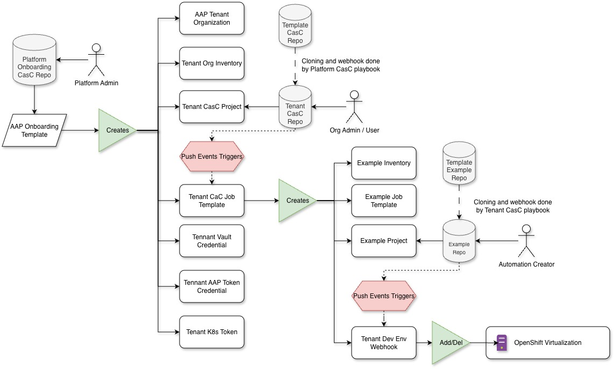

# Ansible Tenant Onboarding

This repository implements an example onboarding process for new
tenants to Ansible Automation Platform. A tenant is a user or a group
of users that would like to deploy and use their automation code on
Ansible Automation Platform (AAP).

> [!NOTE]
> The goal is enabling tenants to work independently of the platform
> team operating Ansible Automation Platform.

> [!WARNING]
> The code in this repository is a proof of concept. It
> it's not considered production ready! You have been warned, this might
> eat your cat.

## Implementation options

Onboarding of tenants by the platform team is done via Configuration
as Code (CaC).

We cover two options in this repository:

- Using [_infra.app_configuration_](https://github.com/redhat-cop/infra.aap_configuration)
- Creating a [custom role](roles/onboard) for onboarding

### Using [_infra.app_configuration_](https://github.com/redhat-cop/infra.aap_configuration)

Our first approach was to leverage the excellent
[_infra.app_configuration_](https://github.com/redhat-cop/infra.aap_configuration)
role for onboarding. This allows a clean separation of configuration
code from configuration data.

The problem with this approach is that it results in complex variable
merging, which we do not consider practical.

The code for this implementation is in
[onboarding-dispatch.yaml](playbooks/onboarding-dispatch.yaml) and the
inventory. The inventory is currently a private repository. We need to
clean this repo up and will change to public after the cleanup.

[_infra.app_configuration_](https://github.com/redhat-cop/infra.aap_configuration)
uses the standard AAP collections _ansible.platform_,
_ansible.controller_, _ansible.hub_ and _ansible.eda_ in the
background. We could have used those collections directly, but this
has the following disadvantages:

- We need to be careful separating automation code and data
- We need to be careful with ordering required objects. For example,
  before a job template is created, the project needs to exist.

The _dispatch_ role in the _infra.aap_configuration_ takes care of
ordering, and by storing configuration data in the inventory we have a
clear distinction between code and data.

### Using a custom role for onboarding


Because we did not want to mess with complex variable merging, we
decided to implement a custom role for onboarding. The roles is
located in [roles/onboard](roles/onboard).

[roles/onboard/main.yaml](roles/onboard/main.yaml) creates the main
objects required for a tenant:

- The organization
- Assign credentials to acccess automation hub
- Creating a local admin user for tokens
- A authentication token and credential for the tenant admin user to deploy AAP configuration via CaC
- A credential to access a OpenShift (Kubernetes) cluster for deployment of virtual machines
- A vault credential for the tenant
- A fork of the template CaC repository
- A webhook on the CaC repository to deploy CaC code on a git push event

The *main* role also includes task for the tenant example project, this role:

- Forks the [template example project](https://github.com/tosmi-ansible/template-example-project)
- Enables a webhook on the forked project

This webhook triggers the
[devenv.yaml](https://github.com/tosmi-ansible/template-org-config/blob/main/playbooks/devenv.yaml)
playbook to deploy a virtual machine for testing new features.

Furthermore there is
[opa_policy.yaml](roles/onboard/tasks/opa_policy.yaml) to add a OPA
policy to the organization.

## Onboarding process and required objects

Each tenant will get

- [x] An organization within AAP
- [x] A GIT clone of a repository for storing AAP Settings for the tenant as CaC ([template-org-config](https://github.com/tosmi-ansible/template-org-config))
- [x] A GIT clone of a repository with an example playbook and inventory ([template-example-project](https://github.com/tosmi-ansible/template-example-project))
- [x] An AAP project pointing to the CaC repository for the tenant
- [x] An AAP project pointing to the example project repository for the tenant
- [x] A job template to trigger synchronization of AAP objects with the configuration stored in the CaC repository
- [x] A job template using the [example project](https://github.com/tosmi-ansible/tenant1-example-project)
- [x] A webhook configured on the tenant CaC repository to trigger updates on _git push_
- [x] A webhook on the example project to deploy new test Virtual Machine on branch creation (see roles/onboard/tasks/example_project.yaml)
- [x] A policy on the tenant organization to enforce nameing conventions on job templates (<id>-<tenant name>-<name of job template)

The example project is a "golden" templates for tenants so they have
an example on how to create their own automation using AAP. It also
provides the option to deploy virtual machines for testing new
features.

There are still some manual tasks required. Those tasks are documented
in section [Manual steps to be
automated](#manual-steps-to-be-automated). The ultimate goal is to
automate these as well, but this is an ongoing project.

## Onboarding process overview

The following diagram illustrates the onboarding process for new tenants:



## Manual steps to be automated

- [ ] Automate creation of tokens for GIT repos (GitLab / GitHub)

## Open Topics

- [ ] Create an execution environment with all collections required for onboarding and CaC
- [ ] Tenant 1 has no inventory source configured, so the second example task using a variable fails
- [ ] Tenant 1 currently uses the Hub tokens for community / certified and validated of the default organization. Not sure if this is a good idea.

## Prerequisites

This section lists prerequisites before the onboarding playbook is able to finish successfully.

### Required Ansible collections must be available on the Private Automation hub

The following collections must be available on the Private Automation Hub:

- ansible.controller (Red Hat Galaxy)
- ansible.platform (Red Hat Galaxy)
- ansible.hub (Red Hat Galaxy)
- ansible.eda (Red Hat Galaxy)
- infra.aap_configuration (Ansible Galaxy)
- infra.aap_utilities (Ansible Galaxy)

### Hints for syncing collections

#### Dependency between _infra_ and ansible_ collections

_infra.*_ collections have dependency on _ansilbe.*_ collections. those _ansible_ collections are only available via Red Hat Galaxy. If we pull the _infra_ collection from Galaxy and _ansible_ from Red Hat Galaxy, the hub community sync job fails because it cannot authenticate to the Red Hat Galaxy. One workaround was to disable dependency syncing in the _community_ remote.

But the _infra_ collections are also available on Red Hat Galaxy. So a better option is to pull everything from Red Hat Galaxy. This way we can avoid the dependency issue and the authentication issue. We need to sync the _validated_ collections to our Private Automation Hub. There's a [knowledge base article](https://access.redhat.com/solutions/7057141) describing required steps.

We added the following under _Automation Content / Remotes / validated / YAML requirements:

```yaml
collections:
  - name: infra.aap_configuration
    version: 3.8.2
  - name: infra.aap_utilities
    version: 2.8.0
```
