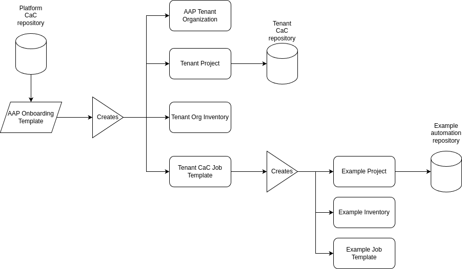

# Ansible Tenant Onboarding

This repository implements an example onboarding for new tenants. A tenant is a user or a group of users that would like to deploy and use their automation code on Ansible Automation Platform (AAP).

The goal is enabling tenants to work independently of the platform team operating Ansible Automation
Platform.

Onboarding of tenants provided by the platform team is done via Configuration as Code (CaC). This repository contains all relevant automation code.

Furthermore, each tenant will get a separate repository containing automation code relevant to the tenant.

Each tenant will get

- [x] An organization within AAP
- [x] A project pointing to the CaC repository for the tenant
- [x] A job template to trigger synchronization of AAP objects with the configuration stored in the CaC repository
- [x] An example repository containing an inventory and a simple playbook

## Onboarding process overview

The following diagram illustrates the onboarding process for new tenants:



## Manual steps to be automated

- [ ] Create API Token for tenant
  - [ ] Create Vault secret key for tenant
  - [ ] Store Vault secret key for tenant as credential in tenant org
  - [ ] Create API token for tenant
  - [ ] Store API Token in tenant vault (org-config inventory)

## Open Topics

- [ ] Create an execution environment with all collections required for onboarding and CaC

## Prerequisites

This section lists prerequisites before the onboarding playbook is able to finish successfully.

### Required Ansible collections must be available on the Private Automation hub

The following collections must be available on the Private Automation Hub:

- ansible.controller (Red Hat Galaxy)
- ansible.platform (Red Hat Galaxy)
- ansible.hub (Red Hat Galaxy)
- ansible.eda (Red Hat Galaxy)
- infra.aap_configuration (Ansible Galaxy)
- infra.aap_utilities (Ansible Galaxy)

### Hints for syning collections

#### Depedency between _infra_ and ansible_ collections

_infra.*_ collections have dependency on _ansilbe.*_ collections. those _ansible_ collections are only available via Red Hat Galaxy. If we pull the _infra_ collection from Galaxy and _ansible_ from Red Hat Galaxy, the hub community sync job fails because it cannot authenticate to the Red Hat Galaxy. One workaround was to disable dependency syncing in the _community_ remote.

But the _infra_ collections are also available on Red Hat Galaxy. So a better option is to pull everything from Red Hat Galaxy. This way we can avoid the dependency issue and the authentication issue. We need to sync the _validated_ collections to our Private Automation Hub. There's a [knowledge base article](https://access.redhat.com/solutions/7057141) describing required steps.

We added the following under _Automation Content / Remotes / validated / YAML requirements:

```yaml
collections:
  - name: infra.aap_configuration
    version: 3.8.2
  - name: infra.aap_utilities
    version: 2.8.0
```
